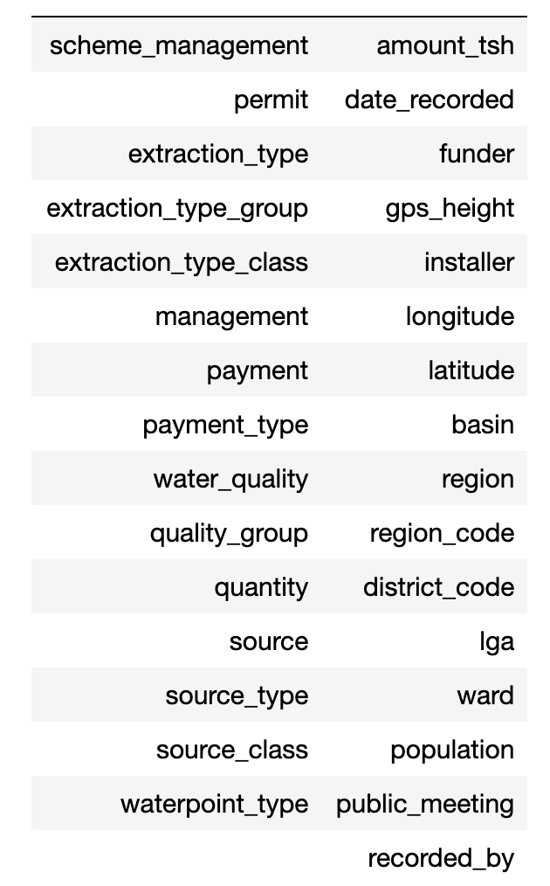
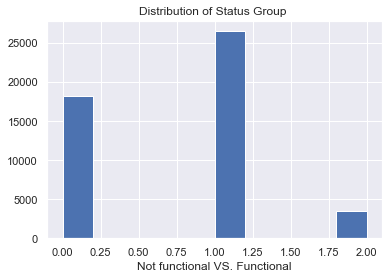
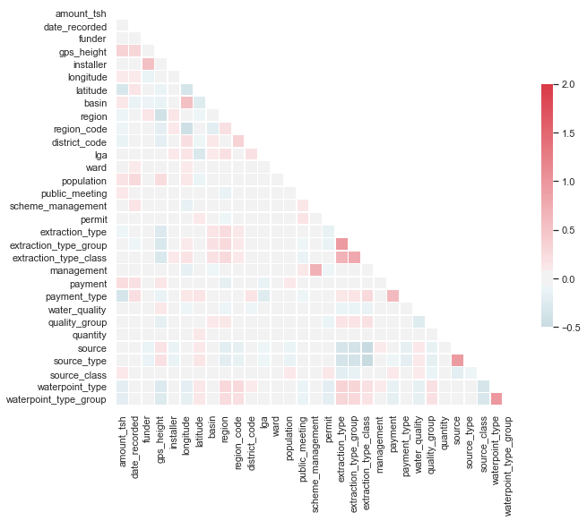
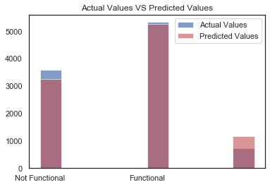

# Week 9 Project  
`Pump-it-Up-Data-Mining-the-Water-Table`

# Goal
The goal of this project is to predict which pumps are functional ( or need some repairs), which are not funtional. KNN, Decision Tree and Random Forest are applied in this project. According to accuracy_score and F1_score, Random Forest model is selected as the final model. 

## Target: 
- not functional :0
- functional :1
- funtional but need to repair :2

## Predictors:

           
# Data Cleaning
- [Enders ( 2003 ) stated that a missing rate of 15% to 20% was common in educational and psychological studies.](https://psycnet.apa.org/record/2003-09632-006) In order to obtian the best prediction, some columns which contian missing data more than 20% were removed. 
- There are 19 Some rows which contains missing values 

# Distribution of Target
-
 - Because the target size for each class is not balanced, so I applied oversampling method to balance the class size.
 
# Feature Engineering
- Train Test Split
- Oversampling
- Data Standardization (MinMaxScaler)
- Feature Selection
  

# Models
- KNN         
- Random Forest 
- Decision Tree

# Conclusion
- After model evaluation, Random Forest model is the best model with highest accuarcy score and f1 socre. 
 
  
- Comparing KNN , Random Forest and Decision Tree models, Random Forest model gave highest accuracy score and F score.  
According to Random Forest model top 5 important features are :
 * 1.'longitude' 
 * 2.'quantity'
 * 3.'latitude'
 * 4.'gps_height'
 * 5.'ward'
 
 

 
 #    
- Source website: https://www.drivendata.org/competitions/7/pump-it-up-data-mining-the-water-table/data/
- Presentation:
https://docs.google.com/presentation/d/16RuNrFkAatRffgyUuw8Lktg78MtJ3fW1VdPh9muhDoM/edit#slide=id.g52d0ce73e5_0_238
